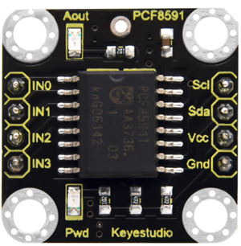
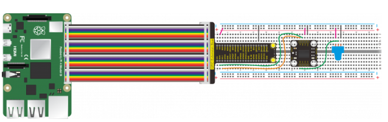
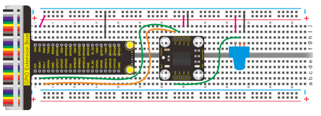
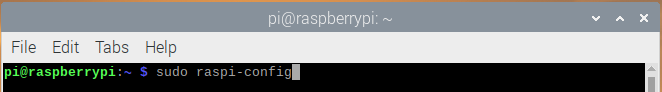
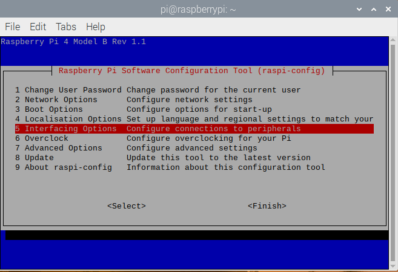
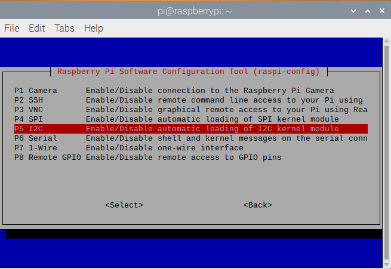
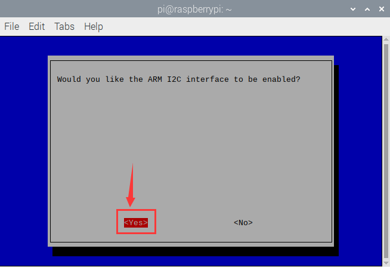
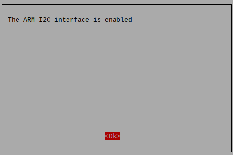
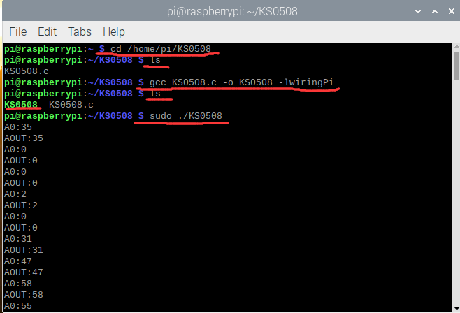

# KS0508 Keyestudio PCF8591 AD Adapter Module



## 1. Description

The analog input and output ports are needed when doing experiment with Raspberry Pi control board. Without analog ports on Raspberry Pi board, therefore, we design this adapter board to convert digital value into analog value.

This module primarily adopts PCF8591chip, including one I2C communication interface, 4 analog input and 1 output ports. The address, control and data signals are transmitted by the serial way of dual wire and direction. Meanwhile, the 2 indicators on the module are controlled by analog output values. In addition, the location holes of module contribute to fix module on the other device. Note: There is a pad hole at silk print PCF8591, which is the Aout port. You need to solder the pins at Aout port if linking with other circuit.

## 2. Technical parameters

- Working voltage: DC 5V
- Main chip: PCF8591
- Communication method: I2C communication
- Pin header spacing: 2.54mm
- Size: 23.2mm * 23.12mm * 11.5mm
- Weight: 2.2g
- Environmental protection attributes: ROHS
- Aperture: 3mm

## 3. Wiring Diagram





## 4. Test Code

```
#include <wiringPi.h>
#include <pcf8591.h>
#include <stdio.h>
#define Address 0x48
#define BASE 64
#define A0 BASE+0
#define A1 BASE+1
#define A2 BASE+2
#define A3 BASE+3

int main(void)
{
      unsigned char value;
      wiringPiSetup();
      pcf8591Setup(BASE,Address);
        
     while(1)
     {
        value=analogRead(A0);              
        printf("A0:%d\n",value);
        analogWrite(BASE,value);      //Write the value to be output at AOUT end
        printf("AOUT:%d\n",value);     //Print the output value of AOUT end

        delay(100);
      }
}
```

## 5. Test Results

In the experiment, we connect the module to the Raspberry Pi 4B control board and wire up.

a. Since iic communication is used, enable the iic communication function of the Raspberry Pi as follows: Raspberry Pi does not enable the I2C function by default. Enter sudo raspi-config in the terminal to enter the Raspberry Pi configuration interface.



b. Enable the I2C function of Raspberry Pi as follows:









1.Set up a folder named KS0508 in Raspberry Pi system and leave KS0508.c file into KS0508 folder.

2.Execute the command at the terminal, control the brightness of Aout LED of Keyestudio PCF8591 A/D adapter board by external potentiometer and print the read the value at the terminal.

cd /home/pi/KS0508 ls gcc KS0508.c -o KS0508 -lwiringPi ls sudo ./KS0508



Press Ctrl+C to exit the test program